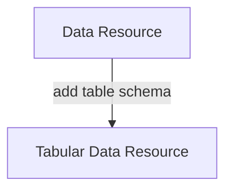
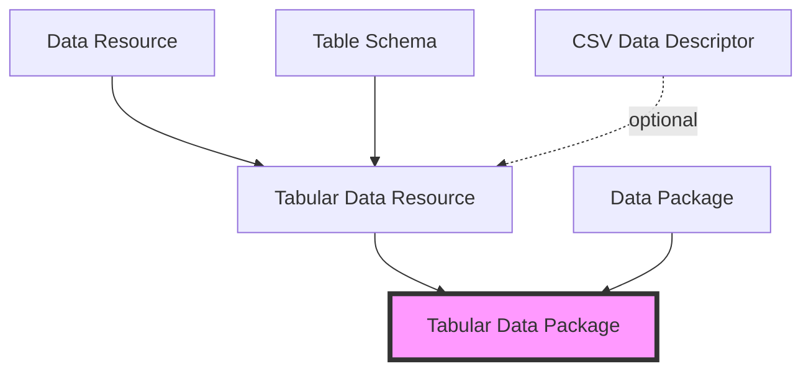

# Frictionless Specifications

At the core of the [Frictionless data toolkit][site] are a set of patterns for describing data including Data Package (for datasets), Data Resource (for files) and Table Schema (for tables).

**This site houses the formal *specifications* of these patterns.**

For more info about the project as a whole, please visit [frictionlessdata.io][site]

## Overview

### What's a Data Package?

A Data Package is a simple container format used to describe and package a collection of data (a dataset).

A Data Package can contain any kind of data. At the same time, Data Packages can be specialized and enriched for specific types of data so there are, for example, Tabular Data Packages for tabular data, Geo Data Packages for geo data etc.

### Data Package Specs Suite

When you look more closely you'll see that Data Package is actually a *suite* of specifications. This suite is made of small specs, many of them usuable on their own, that you can also combine together.

This approach also reflects our philosophy of "small pieces, loosely joined" as well as "make the simple things simple and complex things possible": it easy to just use the piece you need as well to scale up to more complex needs.

For example, for tabular data we can create a Tabular Data Package spec by combining three other specs together: the Data Package spec for the dataset, the Table Schema spec to describe the table structure, and finally CSV or JSON for the data itself.

We also broke down the Data Package spec into Data Package itself and Data Resource. The Data Resource spec just describes an individual data files and a Data Package is a collection of one or more Data Resources with additional dataset-level metadata.

**Example: Data Resource spec + Table Schema spec becomes a Tabular Data Resource spec**

**Example: How a Tabular Data Package is composed out of other specs**

## Design Philosophy

### Simplicity

Seek zen-like simplicity in which there is nothing to add and nothing to take away.

### Extensibility

Design for extensibility and customisation. This makes hard things possible and permits future evolution -- nothing we build will be perfect.

### Human-editable and machine-usable

Specs should preserve human readability and editability whilst making machine-use easy.

### Reuse

Reuse and build on existing standards and formats.

### Cross technology

Support a broad range of languages, technologies and infrastructures -- avoid being tied to any one specific system.

## Contribute

Contributions, comments and corrections are warmly welcomed. Most work proceeds in an RFC-style manner with discussion in the [issue tracker][issues].

Material is kept in a [git repo on GitHub][repo] - fork and submit a pull request to add material. There is also an [issue tracker][issues] which can be used for specific issues or suggestions.

[forum]: https://discuss.okfn.org/c/frictionless-data
[repo]: https://github.com/frictionlessdata/specs
[issues]: https://github.com/frictionlessdata/specs/issues
[site]: http://frictionlessdata.io

## For Editors

This repository is the canonical repository for the core Frictionless Data specifications. The repository features:

- [JSON Schema](http://json-schema.org) representations of all specifications. These are used both in the site itself, to generate the specification pages, and likewise in the *schema registry* that is used by a range of libraries that implement the specifications.

### Quick start

- Clone the repository
- `npm install` # install the dependencies to build the specifications
- `npm run build` # build the specifications
- `npm run test` # test the specifications

### Contribute to the specifications

All the source data for the specifications is in the `/schemas` directory. In there, you will find a `.json` file for each specification and a set of YAML files under `/schemas/dictionary/*`. There is a `build.js` script to build the specifications.

- `.json` files are JSON Schemas for each spec, normalised using the `$ref` feature of JSON Schema. This normalisation ensures consistency in the way the specifications are written and validated, but is only used directly by the `build.js` script, which generated denormalised versions.
- `/build.js` creates denormalised versions of each specification be dereferencing each `$ref` in the source schemas, and then saves these denormalised versions to `/build/schemas` directory.
- `/schemas/dictionary/*` has all the property definitions for each specification. This is the place to add new properties or property collections, to edit contextual information and descriptive examples, and so on. See how this information is rendered in the [macros template](https://github.com/frictionlessdata/specs/blob/master/templates/macros.html).

### Adding a new specification

Yes we welcome and encourage additions to the registry! Any spec that is added must meet the following criteria:

- Be related to the Data Packages family of specifications.
- Have a publicly-accessible web page describing the specification.
- Have a JSON Schema file that describes the specification.

See the existing entries in the registry, and then take the following steps to add a new entry:

1. Make a new pull request called `registry/{NAME_OF_SPECIFICATION}`
2. The pull request features a JSON Schema file for the new specification, and adds the spec to `registry.csv`
3. Write a brief description of the spec as part of the pull request.

<mermaid />
