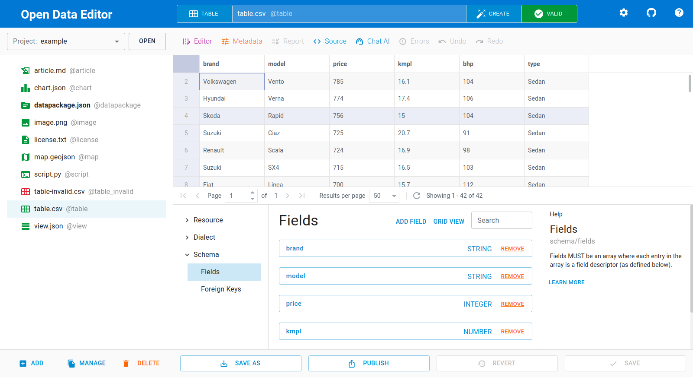

import About from "../../components/about.astro"
import Adoption from "../../components/adoption.astro"
import { CardGrid, LinkCard, Card } from "@astrojs/starlight/components"

## Standard

The Data Package standard is a comprehensive set of **specifications** that collectively define a framework for organizing, documenting, and sharing data in a structured and interoperable manner -- [EXPLORE THE STANDARD](/standard/specifications)

<CardGrid>
  <Card title="Data Package" icon="open-book">
    A simple container format to describe a coherent collection of data (a dataset), including  its contributors, licenses, etc.
  </Card>
  <Card title="Data Resource" icon="rocket">
    A simple format to describe a data resource such as a individual table or file, including its name, format, path, etc.
  </Card>
  <Card title="Table Dialect" icon="document">
    A simple format to describe the dialect of a tabular data file, including its delimiter, header rows, escape characters, etc.
  </Card>
  <Card title="Table Schema" icon="puzzle">
    A simple format to describe tabular data, including field names, types, constraints, missing values, foreign keys, etc.
  </Card>
</CardGrid>

## Software

Data Package is backed by a suite of software tools supporting the standard. From the no-code visual tool **Open Data Editor** to low-level drivers for 10 programming languages -- [EXPLORE THE SOFTWARE](/standard/software)

## Adoption

Data Package is used for a wide range of scenarios where this standardized data packaging format proves invaluable for efficient data management, sharing, and analysis -- [EXPLORE THE ADOPTION](/standard/adoption)

<Adoption />

## Documentation

Read the Data Package documentation to learn more about the standard:

<CardGrid>
  <LinkCard title="Specifications" href="/standard/specifications" />
  <LinkCard title="Extensions" href="/standard/extensions" />
  <LinkCard title="Recipes" href="/standard/recipes" />
  <LinkCard title="Guides" href="/standard/guides" />
</CardGrid>

<About title="Brought to you by">
  We are building a world open by design where all knowledge is accessible to everyone
  [Learn about Open Knowledge](https://okfn.org)
</About>
