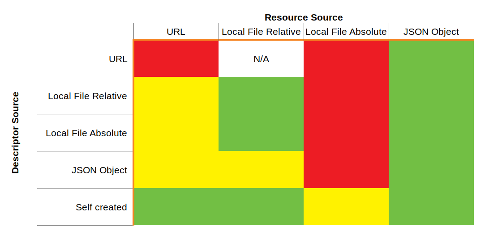

<table>
  <tr>
    <th>Authors</th>
    <td>Johannes Jander, Data Package Working Group</td>
  </tr>
</table>

Security considerations around Data Packages and Data Resources.

## Language

The key words `MUST`, `MUST NOT`, `REQUIRED`, `SHALL`, `SHALL NOT`, `SHOULD`, `SHOULD NOT`, `RECOMMENDED`, `MAY`, and `OPTIONAL` in this document are to be interpreted as described in [RFC 2119](https://www.ietf.org/rfc/rfc2119.txt).

## Usage Perspective

Data packages is a container format that allows the creator to specify payload data (Resources) either as JSON
objects/arrays or via pointers. There are two pointer formats:

- local file system references. Those follow POSIX naming conventions and have to be relative to the Package Descriptor
  file ("datapackage.json"). Absolute paths are disallowed as they would open data exfiltration attacks. They would also
  be rarely useful, considering you typically cannot know the file system layout of the user's computer
- URLs as pointers to remote Resources. They are intended to load datasets from sites like statistic's offices as the
  basis of Data Packages. Only HTTP/HTTPS URLs are allowed, library maintainers have to filter out others like file-URLs

Both formats can open security holes that can be used to attack the user's computer and/or network. It is therefore
STRONGLY recommended to limit the kind of Resource pointers you allow on your machines if you accept Data Packages
from third party sources.

ONLY in a trusted environment (eg. your own computer during development of Data Packages) is it recommended to allow
all kinds of Resource pointers. In every other environment, you MUST keep the various attack scenarios in mind and
filter out potentially dangerous Resource pointer types

### Dangerous Descriptor/Resource pointer combinations

How to read the table: if your "datapackage.json"-file comes from one of the sources on the left, you should treat
Resources in the format on the top as:

- red: disallowed
- yellow: potentially dangerous
- green: safe to use

#### Descriptor source is a URL

If your descriptor is loaded via URL, and the server to which the URL points is not fully trusted, you
SHOULD NOT allow Data Packages with Resource pointers in

- URLs. As described in [issue #650](https://github.com/frictionlessdata/specs/issues/650), URLs crafted by the author
  of a Data Package can be used in a "keyhole" attack to probe your network layout.
- Absolute file system references. Absolute paths can be used to exfiltrate system files (eg. /etc/passwd on
  Unix-like systems). Relative paths will be converted to URLs relative to the descriptor URL, so they will
  not load data from the local file system and are therefore safe.

URL-based Resource pointers can furthermore be used for denial of service attacks on either the user's system or a
service hosting Resource data. A relatively small Data Package could still hold thousands of Resource URLs that
each could point to very large CSV files hosted somewhere. The Data Package processing library would load all
those CSV files which might overwhelm the user's computer. If an attacker were able to spread such a malicious
Data Package, this could exhaust the resources of a hosting service.

#### Descriptor source is a local relative path

If your descriptor is loaded via a local relative path, and the source of the Data Package is not fully trusted, you
SHOULD NOT allow Data Packages with Resource pointers in

- URLs. As described in [issue #650](https://github.com/frictionlessdata/specs/issues/650), URLs crafted by the author
  of a Data Package can be used in a "keyhole" attack to probe your network layout.
- Absolute file system references. Absolute paths can be used to exfiltrate system files (eg. /etc/passwd on
  Unix-like systems). Relative paths will be converted to paths relative to the Descriptor file system reference,
  so they are considered harmless.

As long as the producer of the Data Package is on the same local network as the computer/server parsing it, it is
considered safe to reference Resources via URLs, as the creator could map the network from their own workstation just
as well as crafting malicious Data Packages. In the above table, this case is therefore coded in yellow.

If Data Package parsing is part of a service offered to computers across subnets on the same LAN or even open to the
internet, it NEVER safe to accept Data Packages containing URL-based Resource pointers.

#### Descriptor source is a local relative path

While it is never safe to accept absolute file paths for Resources, it is perfectly safe to accept them for Descriptor
files. If your descriptor is loaded via a local absolute path, and the source of the Data Package is not fully
trusted, you SHOULD NOT allow Data Packages with Resource pointers in

- URLs. As described in [issue #650](https://github.com/frictionlessdata/specs/issues/650), URLs crafted by the author
  of a Data Package can be used in a "keyhole" attack to probe your network layout.
- Absolute file system references. Absolute paths can be used to exfiltrate system files (eg. /etc/passwd on
  Unix-like systems). Relative paths will be converted to paths relative to the Descriptor file system reference,
  so they are considered harmless.

As long as the producer of the Data Package is on the same local network as the computer/server parsing it, it is
considered safe to reference Resources via URLs, as the creator could map the network from their own workstation just
as well as crafting malicious Data Packages. In the above table, this case is therefore coded in yellow.

If Data Package parsing is part of a service offered to computers across subnets on the same LAN or even open to the
internet, it NEVER safe to accept Data Packages containing URL-based Resource pointers.

#### Descriptor source is a JSON object

If the Descriptor is not loaded from file but created in-memory and the source of the Data Package is not fully
trusted, you SHOULD NOT allow Data Packages with Resource pointers in

- URLs. As described in [issue #650](https://github.com/frictionlessdata/specs/issues/650), URLs crafted by the author
  of a Data Package can be used in a "keyhole" attack to probe your network layout.
- file system references, relative or absolute. Absolute paths can be used to exfiltrate system files
  (eg. /etc/passwd on Unix-like systems). Relative paths would be constructed relative to the parsing software's working
  directory and could be used to guess at configuration files to exfiltrate. OTOH, in creation of a Data Package,
  and if the relative paths are confined to a subdirectory, it is safe to use relative paths.

As long as the producer of the Data Package is on the same local network as the computer/server parsing it, it is
considered safe to reference Resources via URLs, as the creator could map the network from their own workstation just
as well as crafting malicious Data Packages. In the above table, this case is therefore coded in yellow.

If Data Package parsing is part of a service offered to computers across subnets on the same LAN or even open to the
internet, it NEVER safe to accept Data Packages containing URL-based Resource pointers.

#### Descriptor source is a self-created JSON object

If the Descriptor is not loaded from file or created via a third-party application but by your software, it is
generally assumed you know what you do and therefore, loading Resources from URLs or file is considered safe. You
still SHOULD NOT use absolute paths as a matter of precaution - and implementing libraries should filter them out.

## Implemention Perspective

Two kinds of Resource pointers can never be guaranteed to be totally safe:

- Absolute file system references. Absolute paths can be used to exfiltrate system files (eg. /etc/passwd on
  Unix-like systems). In your implementation, you SHOULD either raise an error if an absolute local path is encountered
  or relativize it to the Descriptor path.
- URLs. As described in [issue #650](https://github.com/frictionlessdata/specs/issues/650), URLs crafted by the author
  of a Data Package can be used in a "keyhole" attack to probe your user's network layout. It is up to the library creator
  to create means that allow their users to mitigate this attack.

As URLs are part of the DNA of Data Packages, it is not advisable to disallow their use completely. However, you should
allow for a security setting that stops your implementation from loading URL-based Resources. This could be done

- via a setting switch (`insecure`/`default`) that allows the user of your library implementation to allow or
  disallow absolute file paths and URL-based Resource pointers
- via a pluggable security filter that is applied as an interceptor _before_ loading any pointer-based Resources. If
  you decide to use such a scheme, you SHOULD provide default implementations for a filter disallowing URL-based
  Resource and an insecure filter that allows loading of all Resources.

### Security Filters

If disallowing all URL-based Resources is too heavy-handed and allowing all is too insecure, finer-grained filters
should be implemented. Those finer security filters can be implemented as either blacklist or whitelist filters.
Blacklist filters in principle allow all URLs and restrict some, whereas whitelist filters deny all as a default
and have a limited list of allowed URLs.

Blacklist filters in their most basic implementation would have to disallow all non-routed IP-addresses like the
192.168.x.x range or the 10.100.x.x range. This would blunt mapping attacks against the internal network of your users
but needs to be well thought out as even one omission could endanger network security

Whitelist filters are much more secure as they allow the loading of Resources from a named list of domains only, but
might be too restrictive for some uses.
