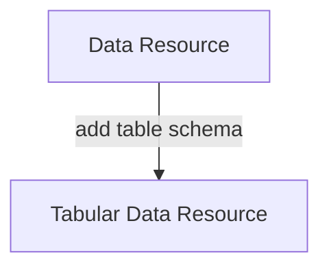
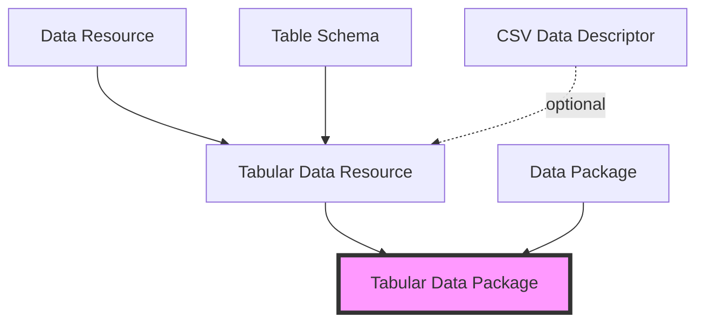

When you look more closely you'll see that Data Package is actually a _suite_ of specifications. This suite is made of small specs, many of them usuable on their own, that you can also combine together.

This approach also reflects our philosophy of "small pieces, loosely joined" as well as "make the simple things simple and complex things possible": it easy to just use the piece you need as well to scale up to more complex needs.

For example, for tabular data we can create a Tabular Data Package spec by combining three other specs together: the Data Package spec for the dataset, the Table Schema spec to describe the table structure, and finally CSV or JSON for the data itself.

We also broke down the Data Package spec into Data Package itself and Data Resource. The Data Resource spec just describes an individual data files and a Data Package is a collection of one or more Data Resources with additional dataset-level metadata.

## Examples

**Example: Data Resource spec + Table Schema spec becomes a Tabular Data Resource spec**

**Example: How a Tabular Data Package is composed out of other specs**

